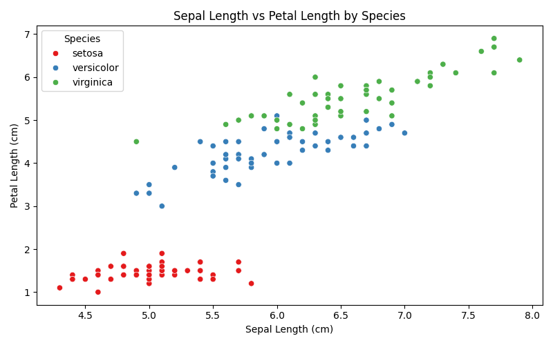
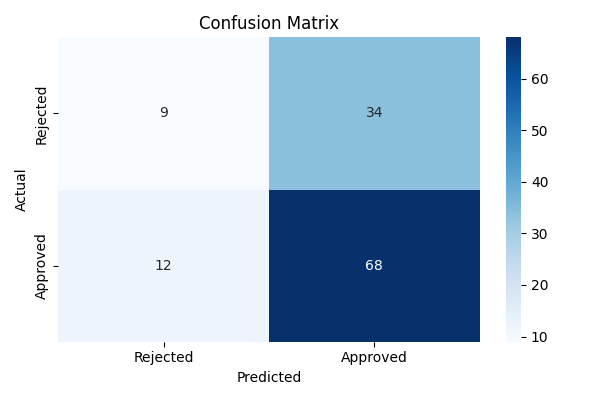
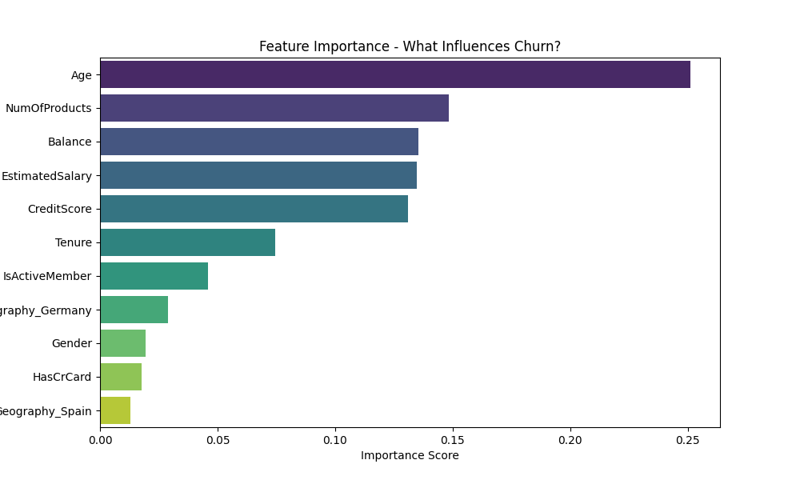
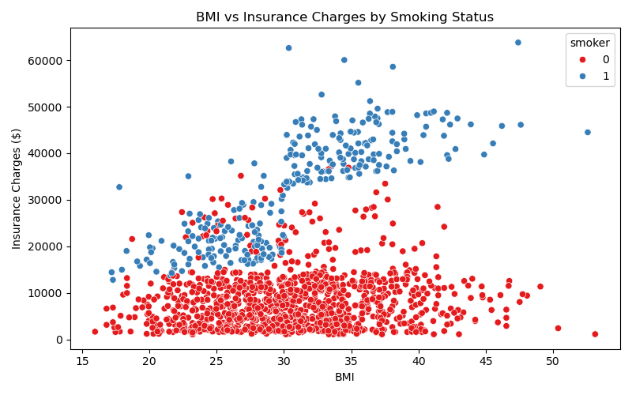
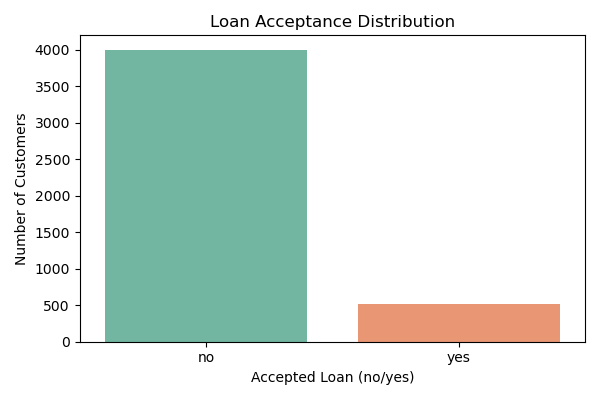

# 🏦 DevelopersHub Data Science & Analytics Internship

**Author:** Khola Asghar

**Organization:** DevelopersHub Corporation

**Tasks Completed:** 5 out of 5 

---

##  Overview

This repository contains all 5 Data Science tasks completed as part 
of the DevelopersHub Corporation Data Science and Analytics Internship. 
Each task covers a different real-world data science problem including 
data exploration, classification, regression, and business insight 
extraction using Python and machine learning libraries.

---

##  Tools and Technologies Used

| Tool | Purpose |
|---|---|
| Python 3 | Programming Language |
| Jupyter Notebook | Development Environment |
| pandas | Data Loading and Manipulation |
| numpy | Numerical Operations |
| matplotlib | Data Visualization |
| seaborn | Advanced Visualization |
| scikit-learn | Machine Learning Models |

## 📂 Repository Structure---
DevelopersHub-Data-Science-Internship/
│
├── 📁 Task1-Iris-Analysis/
│   └── notebook + visualizations
│
├── 📁 Task2-Credit-Risk/
│   └── notebook + visualizations
│
├── 📁 Task3-Customer-Churn/
│   └── notebook + visualizations
│
├── 📁 Task4-Insurance-Prediction/
│   └── notebook + visualizations
│
├── 📁 Task5-Loan-Acceptance/
│   └── notebook + visualizations
│
└── 📄 README.md

---

## Task 1: Exploring and Visualizing the Iris Dataset

### Objective
Understand how to read, summarize and visualize a real dataset
using pandas, matplotlib and seaborn.

### Dataset
- **Name:** Iris Dataset
- **Source:** Seaborn built-in dataset
- **Size:** 150 rows, 5 columns
- **Features:** Sepal length, sepal width, petal length, petal width, species

### Approach
- Loaded and inspected dataset using pandas
- Explored structure using shape, columns and head()
- Created scatter plot, histogram and box plot

### Key Insights
- Setosa is clearly separated from other species based on petal measurements
- Petal length and width are stronger indicators of species than sepal measurements
- Virginica has the longest petals while Setosa has the shortest
- No missing values found in the dataset

### Visualizations Created
- Scatter plot of sepal length vs petal length colored by species
- Histogram showing distribution of sepal length
- Box plot showing petal length spread across species

---

##  Task 2: Credit Risk Prediction

### Objective
Predict whether a loan applicant is likely to default on a loan
using machine learning classification.

### Dataset
- **Name:** Loan Prediction Dataset
- **Source:** Kaggle
- **Size:** 614 rows, 13 columns
- **Target:** Loan Status (Approved/Rejected)

### Approach
- Handled missing values using median and mode imputation
- Encoded categorical features using Label Encoding
- Trained Random Forest Classifier with 500 trees

### Model Performance
| Metric | Score |
|---|---|
| Accuracy | 82% |
| Model Used | Random Forest |
| Train/Test Split | 80% / 20% |

### Key Insights
- Credit history is the strongest predictor of loan approval
- Graduates have significantly higher approval rates than non-graduates
- Applicants with higher incomes are more likely to get loans approved
- Most loan amounts fall between 100 and 200 units

---

##  Task 3: Customer Churn Prediction

### Objective
Identify bank customers who are likely to leave using
classification modeling and feature importance analysis.

### Dataset
- **Name:** Churn Modelling Dataset
- **Source:** Kaggle
- **Size:** 10,000 rows, 14 columns
- **Target:** Exited (1=Left, 0=Stayed)

### Approach
- Removed irrelevant columns (RowNumber, CustomerId, Surname)
- Encoded Geography using One-Hot Encoding
- Encoded Gender using Label Encoding
- Trained Random Forest Classifier with 500 trees

### Model Performance
| Metric | Score |
|---|---|
|  Accuracy | 86.40% |
| Model Used | Random Forest |
| Train/Test Split | 80% / 20% |
| Stayed Recall | 96% |
| Churned Recall | 47% |

### Key Insights
- Age is the most important predictor with importance score of 0.240
- Germany has significantly higher churn rate than France and Spain
- Customers aged 40-60 are most likely to leave the bank
- High balance customers show unexpected higher churn rates
- Female customers churn slightly more than male customers

---

## Task 4: Predicting Insurance Claim Amounts

### Objective
Estimate medical insurance charges based on personal data
using Linear Regression modeling.

### Dataset
- **Name:** Medical Cost Personal Dataset
- **Source:** Kaggle
- **Size:** 1,338 rows, 7 columns
- **Target:** Charges (continuous numerical value)

### Approach
- Encoded categorical features (sex, smoker, region)
- Trained Linear Regression model
- Evaluated using MAE and RMSE metrics
- Visualized impact of BMI, age and smoking on charges

### Model Performance
| Metric | Score |
|---|---|
| Model Used | Linear Regression |
| Evaluation | MAE and RMSE |
| Train/Test Split | 80% / 20% |

### Key Insights
- Smoking status is the strongest predictor of insurance charges
- Smokers pay 3 to 4 times more than non-smokers on average
- Charges increase consistently with age
- BMI combined with smoking leads to the highest insurance costs
- Correlation heatmap confirms smoking, age and BMI as top predictors

---

## Task 5: Personal Loan Acceptance Prediction

### Objective
Predict which bank customers are likely to accept a personal
loan offer using classification modeling.

### Dataset
- **Name:** Bank Marketing Dataset
- **Source:** UCI Machine Learning Repository
- **Size:** 4,521 rows, 17 columns
- **Target:** y (yes=Accepted, no=Rejected)

### Approach
- Performed data exploration on age, job and marital status
- Encoded all categorical features using Label Encoding
- Trained Decision Tree Classifier with max depth of 10
- Analyzed feature importance for business insights

### Model Performance
| Metric | Score |
|---|---|
|  Accuracy | 88.84% |
| Model Used | Decision Tree |
| Train/Test Split | 80% / 20% |

### Key Insights
- Duration of last contact is the strongest predictor of acceptance
- Younger customers aged 25-40 are more likely to accept loans
- Students and retired customers show higher acceptance rates
- Single customers accept loans more than married customers
- Model correctly predicts nearly 9 out of 10 outcomes

---

##  Model Performance Comparison

| Task | Model | Accuracy |
|---|---|---|
| Task 1 | Visualization Only | N/A |
| Task 2 | Random Forest | 82.00% |
| Task 3 | Random Forest | 86.40% |
| Task 4 | Linear Regression | MAE + RMSE |
| Task 5 | Decision Tree | 88.84% |

---

##  Key Learnings

Through these 5 tasks I developed the following skills:

- Loading, cleaning and preparing real world datasets using pandas
- Handling missing values using median and mode imputation
- Encoding categorical features using Label and One-Hot Encoding
- Creating professional visualizations using matplotlib and seaborn
- Training classification models including Random Forest and Decision Tree
- Training regression models using Linear Regression
- Evaluating models using accuracy, confusion matrix, MAE and RMSE
- Extracting business insights from machine learning results
- Presenting findings in a clear and professional manner

---

**Author:** Khola Asghar 

**Internship:** DevelopersHub Corporation

**Date:** 24 April 2026
